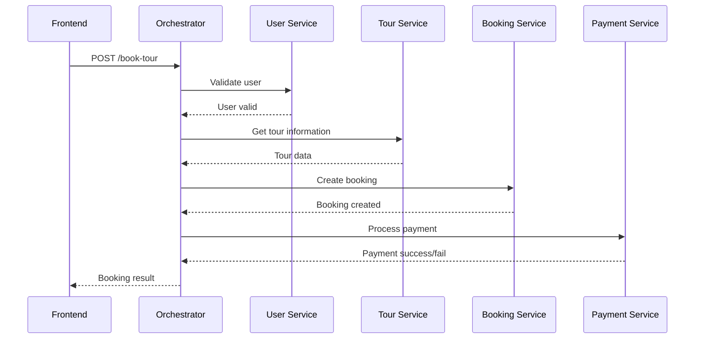

# Buổi 8: ORCHESTRATION-DRIVEN SOA

## Bài toán: Travel Booking System

Xây dựng hệ thống đặt tour với các bước:

- Người dùng chọn tour
- Đặt tour
- Thanh toán
- Nhận xác nhận

---

## 1. Chức năng chính

### 1.1. Quản lý người dùng

- Đăng ký
- Đăng nhập

### 1.2. Quản lý tour

- Xem danh sách tour
- Xem chi tiết tour

### 1.3. Đặt tour

- Tạo booking

### 1.4. Thanh toán

- Thanh toán booking

### 1.5. Xác nhận

- Gửi thông báo booking thành công

---

## 2. Yêu cầu kiến trúc

Áp dụng mô hình **Orchestration-Driven SOA**.

### Nguyên lý

- Có **Orchestrator Service** đóng vai trò trung tâm.
- Các service khác:
  - Không gọi nhau trực tiếp.
  - Chỉ nhận lệnh từ **Orchestrator**.

---

## 3. Thành phần hệ thống

| Thành phần | Vai trò |
|---|---|
| Orchestrator | Điều phối toàn bộ flow |
| User Service | Quản lý user |
| Tour Service | Quản lý tour |
| Booking Service | Tạo booking |
| Payment Service | Thanh toán |

---

## 4. Phân công 5 người

### Người 1 – Frontend

**Công nghệ:** ReactJS

#### UI

- Login
- Xem tour
- Đặt tour

#### Quy tắc gọi API

- Chỉ gọi **Orchestrator Service**
- Không gọi trực tiếp các service khác

---

### Người 2 – Orchestrator Service

#### API

```http
POST /book-tour
```

#### Flow trong Orchestrator

1. Validate user thông qua **User Service**
2. Lấy thông tin tour từ **Tour Service**
3. Tạo booking thông qua **Booking Service**
4. Gọi **Payment Service**
5. Trả kết quả về **Frontend**

> Tất cả giao tiếp giữa các service đều sử dụng **REST API**.

---

### Người 3 – User Service

#### API

```http
POST /login
GET /users/{id}
```

---

### Người 4 – Tour Service

#### API

```http
GET /tours
GET /tours/{id}
```

---

### Người 5 – Booking Service + Payment Service

#### Booking Service API

```http
POST /bookings
```

#### Payment Service API

```http
POST /payments
```

#### Logic

- Random kết quả thanh toán:
  - Success
  - Fail

---

## 5. Triển khai trên LAN

| IP | Service |
|---|---|
| 192.168.1.10:8080 | Orchestrator |
| 192.168.1.11:8081 | User |
| 192.168.1.12:8082 | Tour |
| 192.168.1.13:8083 | Booking |
| 192.168.1.14:8084 | Payment |
| 192.168.1.15:3000 | Frontend |

---

## 6. Flow chi tiết

### Flow đặt tour

1. **Frontend** gửi request đến **Orchestrator**
2. **Orchestrator** lần lượt gọi:
   - User Service
   - Tour Service
   - Booking Service
   - Payment Service
3. **Orchestrator** trả kết quả về **Frontend**

---

## 7. Sơ đồ flow



---

## 8. Ghi chú kiến trúc

Trong mô hình **Orchestration-Driven SOA**:

- **Orchestrator** là service trung tâm điều phối toàn bộ quy trình.
- Các service nghiệp vụ như **User**, **Tour**, **Booking**, **Payment** chỉ xử lý chức năng riêng.
- Frontend không được gọi trực tiếp vào các service nghiệp vụ.
- Các service nghiệp vụ không gọi chéo lẫn nhau.
- Luồng xử lý tập trung giúp dễ kiểm soát flow nghiệp vụ.
